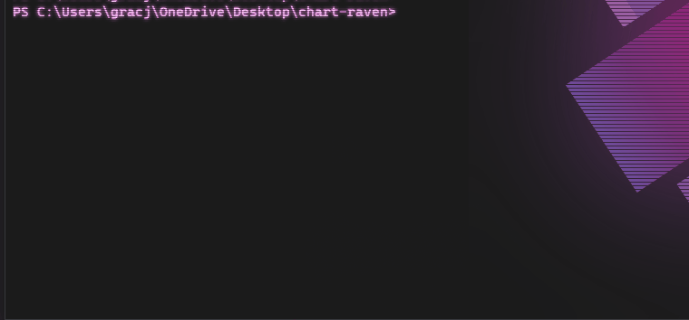

# Secured RavenDB Cluster Helm Chart ☸️

## Overview
This Helm chart provides all necessary components for the secured RavenDB cluster. It's very easy to deploy & manage your own RavenDB cluster by using it.


## Prerequisites 

- RavenDB License (obtained via https://ravendb.net - also works with the free developer license)
- RavenDB Setup Package (created using RavenDB Setup Wizard or with the *rvn* utility)


### Pre-install
Run the [generate-values-from-package.py](https://github.com/ravendb/helm-charts/tree/master/charts/ravendb-cluster/misc) script. It automatically generates proper `values.yaml` for the Helm chart, based on the setup package. 

Usage: `python ./generate-values-from-package.py [input - path to setup package] [output - path to yaml file] [chart - path to helm chart]`

Example: `python ./generate-values-from-package.py ./pack.zip ../values.yaml -c ../../chart`

Help: `python .\generate-values-from-package.py --help` 

After that, customize your output, following the steps below.

## Installation

`helm install [name] [chart path]`


Before installation you should run `generate-values-from-package.py` and then customize `values.yaml`.
- Enter how big should be `storageSize` on each node.
- Provide `ingressClassName` (e.g. nginx, haproxy...)


- Select desired RavenDB image tag (`latest` by default, tags are available on [DockerHub](https://hub.docker.com/r/ravendb/ravendb/tags)) 
- *using a fixed (not floating like 'latest') tag is considered as a good practice*.


- In some cases you might want to edit [image pull policy](https://kubernetes.io/docs/concepts/containers/images/#image-pull-policy).
- If you need some environmental values inside the RavenDB container, you can define them in the `environment` map.

### Example values.yaml

```yaml
# customizable
storageSize: 5Gi
ravenImageTag: latest
imagePullPolicy: IfNotPresent
ingressClassName: nginx

# these values are generated by the script and shouldn't be changed
nodes:
  - nodeTag: a
    publicTcpPort: 443
  - nodeTag: b
    publicTcpPort: 443
  - nodeTag: c
    publicTcpPort: 443
    
domain: "ravendb.poisson.net"
packageFileGlobPath: misc/pack.zip
letsEncryptEmail: user@example.net
setupMode: LetsEncrypt
license: < license json >

# optional, for hackers
environment:
  SOME_ENV_VALUE: 'foo'
  SOME_OTHER_ENV_VALUE: 'bar'
```

 



---
## How do I make this work?
---
## Configure your DNS 

Make sure that your DNS contains records that translate RavenDB nodes addresses to the ingress controller IP address. Pods need these to talk to each self. You need to translate 
- `<nodeTag>.[domain]`
- `<nodeTag>-tcp.[domain]`

names to ingress controller IP address.


*e.g. Additional record inside /etc/hosts file, `192.168.1.15` is my local IP address, running nginx on local machine k8s cluster*

```
192.168.1.15 a.raven.domain.com b.raven.domain.com c.raven.domain.com 
192.168.1.15 a-tcp.raven.domain.com b-tcp.raven.domain.com c-tcp.raven.domain.com 
```

*Dns records can't point to localhost/loopback/0.0.0.0, basically it'll tell the pods to reach nginx on themselves, not on our machine - use your local IP address.*

---
## Set up your ingress controller

It must be able to **passthrough SSL** like Nginx/HAProxy.


### NGINX

Use `--enable-ssl-passthrough` option.


If you've deployed k8s nginx before, its dependencies are frequently stored in the 'ingress-nginx' namespace.
You can deploy nginx to k8s using the `nginx-ingress-ravendb.yaml` file located in the misc folder, which is preconfigured for default nodes/tags/ports and secured connection.
It is not necessary, but running `kubectl delete all --all -n ingress-nginx` should delete all nginx k8s depts before another deployment.
Run `kubectl apply -f [path to 'nginx-ingress-ravendb' file]` to either update or install well configured nginx ingress controller locally.

If you want to configure it manually, make sure that...
- ... port 38888 (or your own ServerUrl_Tcp port) is exposed on the nginx controller pod
- ... --enable-ssl-passthrough is set (when working with secured cluster)

### HAProxy, Traefik and others

Change the `ingressClassName` in the `values.yaml`, enter your deployed ingress class name.

e.g. `ingressClassName: haproxy`

**Remember to enable SSL passtrough on your ingress controller**

https://doc.traefik.io/traefik/routing/routers/#passthrough

https://serversforhackers.com/c/using-ssl-certificates-with-haproxy


## Rolling updates

You can perform rolling update using the `rolling-update.sh` script located in the `/scripts` directory. Provide desired RavenDB image tag from the DockerHub https://hub.docker.com/r/ravendb/ravendb/tags as the first arg and path to the Helm chart as the second.

`./rolling-update.sh latest ~/ravendb-cluster`

It'll execute rolling update strategy and update your pods image tags.
